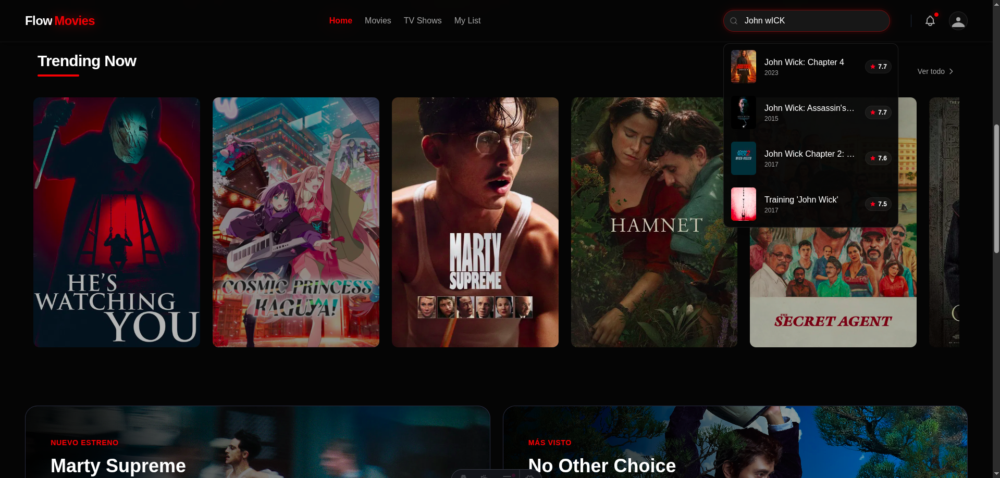

# 🎬 FlowMovie
### *Tu Portal Cinematográfico de Siguiente Generación*

FlowMovie no es solo otra base de datos de películas; es una experiencia inmersiva diseñada para cinéfilos que valoran tanto el contenido como la estética. Con una interfaz fluida, minimalista y de alto rendimiento, FlowMovie redefine cómo exploras el séptimo arte.

## 🎯 Propósito del Proyecto

FlowMovie nació como un desafío personal de aprendizaje y experimentación técnica. El objetivo principal fue profundizar en las herramientas más modernas del desarrollo web actual:

- **Dominio de APIs:** Implementación exhaustiva de la API de TMDB, gestionando datos asíncronos en tiempo real, búsqueda multi-formato y endpoints dinámicos.
- **Exploración de Astro v5:** Descubrir el potencial de la arquitectura de "Islas", el Server Side Rendering (SSR) y las nuevas funcionalidades de Astro para maximizar el rendimiento.
- **Diseño con Tailwind CSS v4:** Experimentar con la última versión de Tailwind para construir una interfaz oscura ("Dark Mode") premium, utilizando variables CSS nativas y micro-interacciones.

## ✨ La Experiencia Flow

FlowMovie ha sido diseñado bajo la filosofía de "Contenido Primero", eliminando el ruido visual para que las historias sean las protagonistas.

- **🚀 Navegación Ultra-Rápida:** Gracias a la arquitectura de Astro v5, la transición entre películas y series es instantánea.
- **🎨 Estética Premium:** Un diseño oscuro profundo con acentos vibrantes, tipografía moderna y efectos de "glassmorphism" que se sienten de vanguardia.
- **📱 Experiencia Fluida:** Micro-animaciones y efectos de hover que hacen que la interfaz se sienta viva y receptiva en cualquier dispositivo.

## 🌟 Funcionalidades Destacadas

### 🎥 Descubrimiento Sin Límites
Explora un catálogo masivo de películas y series con datos actualizados en tiempo real. Desde los últimos estrenos hasta los clásicos atemporales, todo está a un clic de distancia.

### 🔥 Tendencias al Momento
Mantente al día con lo que el mundo está viendo. Nuestra sección de tendencias utiliza algoritmos actualizados para mostrarte qué es lo más popular hoy mismo.

### 🔍 Búsqueda Inteligente
Encuentra exactamente lo que buscas con nuestro sistema de búsqueda multi-formato. Escribe un título y obtén resultados instantáneos de películas y series de televisión.

### 🎭 Detalles Enriquecidos
Cada título cuenta con una página dedicada donde puedes consultar sinopsis detalladas, puntuaciones de la crítica, géneros y dónde ver el contenido (Proveedores de streaming).

## 🛠️ El Motor Bajo el Capó

Para lograr esta fluidez y calidad visual, FlowMovie utiliza:
- **Astro v5** para una entrega de HTML ultra-optimizada.
- **React 19** para los componentes que requieren interactividad compleja.
- **Tailwind CSS v4** para un sistema de diseño consistente.
- **TMDB API** como el cerebro que alimenta nuestro vasto catálogo.

---

## 🚀 Cómo empezar (Para Desarrolladores)

1. **Instalación:** `npm install`
2. **Entorno:** Configura tu `TMDB_TOKEN` en un archivo `.env`.
3. **Despegue:** `npm run dev`

---

Desarrollado con pasión por [Kevingedev](https://github.com/Kevingedev)
